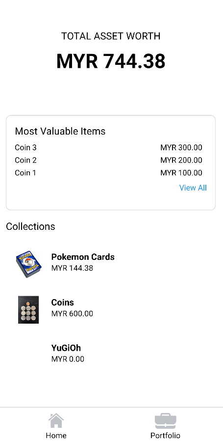
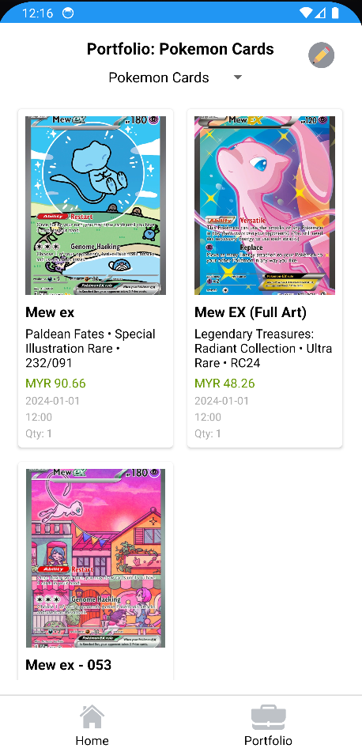
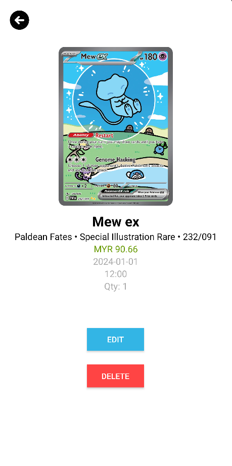

# Gradr App

Gradr is a mobile application designed for collectors to efficiently manage and track their collections. Whether you're into coins, stamps, Pokémon cards, or any other collectible items, Gradr offers an intuitive and customizable platform to keep your collections organized and accessible. 

## Features



- **Collection Management**: Create and organize collections for different types of items.
- **Portfolio View**: Display detailed information about individual items in your collections.
- **User-Friendly Interface**: Modern UI designed for a seamless user experience.
- **Customizable Collections**: Add personalized details and categorize items as needed.
- **Future Expandability**: Incorporates feedback and ideas for continuous improvement.



## Motivation

As a collector, the need for a tool to simplify collection tracking and management inspired the development of Gradr. This app reflects both a personal passion for collecting and a drive to create a functional tool for collectors worldwide.

## Tech Stack

- **Platform**: Android
- **Languages**: Java/Kotlin
- **Development Tools**: Android Studio
- **UI Resources**: Design inspirations from UI/UX books and popular design platforms

## Installation

To get started with Gradr:

1. Clone this repository:
   ```bash
   git clone https://github.com/<your-username>/gradr.git
   ```

2. Open the project in Android Studio.
3. Sync Gradle and resolve dependencies.
4. Build and run the project on an emulator or physical device.

## Usage

1. Launch the app and navigate to the main activity to view your collections.
2. Select a collection to view its detailed portfolio.
3. Add or edit items within your collection as needed.

## Roadmap

- **Enhanced Search Functionality**: Implement advanced search filters.
- **Cloud Backup**: Add cloud synchronization to ensure data safety.
- **Social Features**: Enable users to share their collections with others.
- **Analytics**: Provide insights into collection value and trends.

## Contribution

Contributions are welcome! If you'd like to enhance Gradr or fix bugs, follow these steps:

1. Fork the repository.
2. Create a new branch:
   ```bash
   git checkout -b feature-name
   ```
3. Commit your changes:
   ```bash
   git commit -m "Add your message here"
   ```
4. Push to your branch:
   ```bash
   git push origin feature-name
   ```
5. Create a pull request.

## Acknowledgements

- Adam Wathan and Steve Schoger's *Refactoring UI* for design inspiration.
- Online resources and the developer community for technical support.

---

Feel free to reach out with questions or suggestions! Happy collecting!
